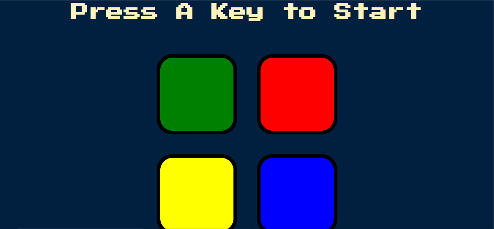

# Simon-Game
This is a web based game implemented using HTML,CSS, Javascript and frontend libraries like jQuery.

### Note : jQuery is used instead of Javascript to shorten the code.

# Prototype
  
